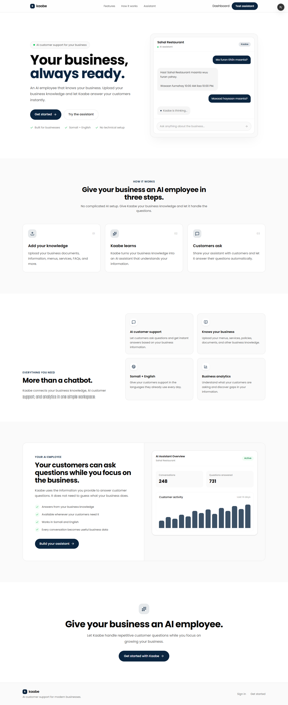
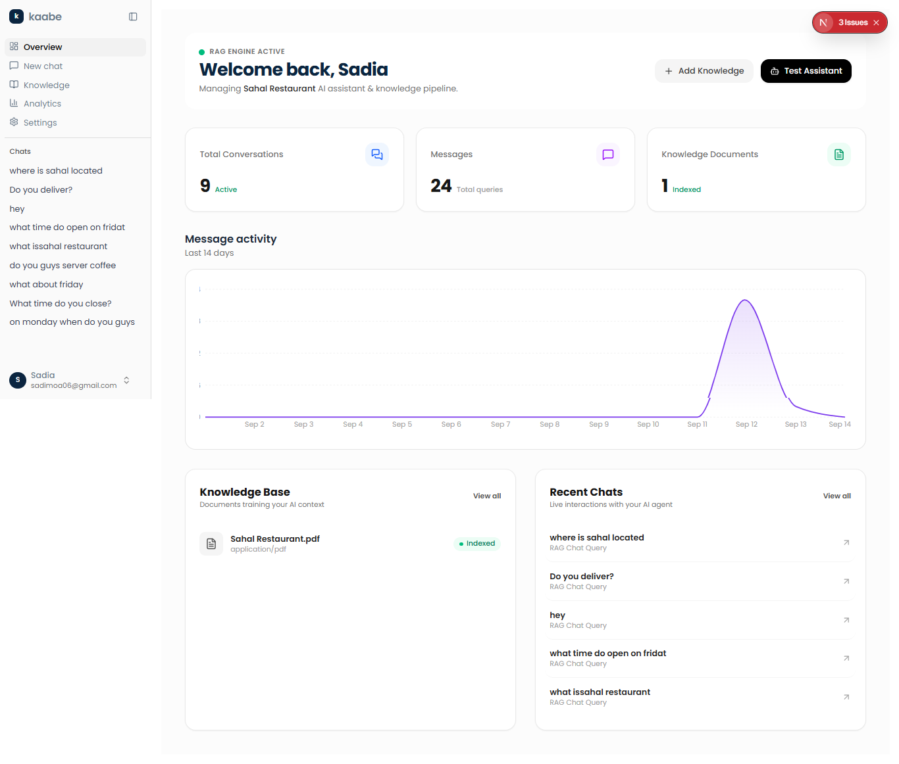
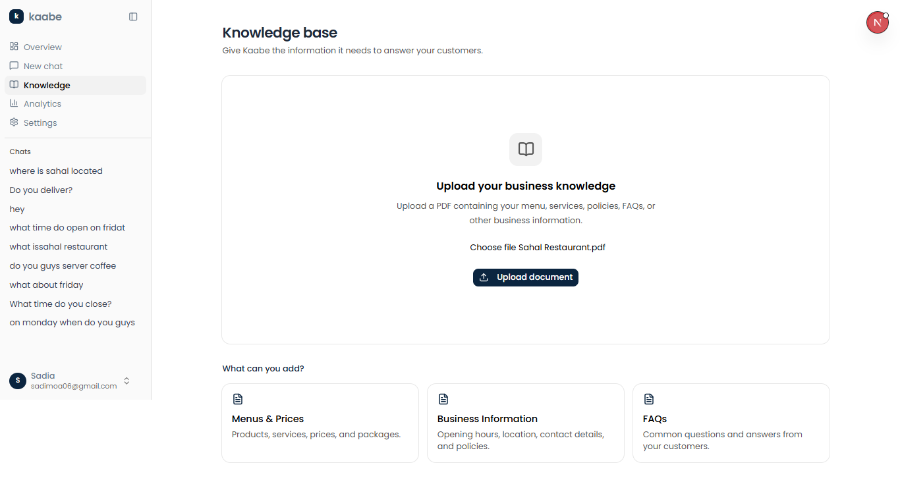
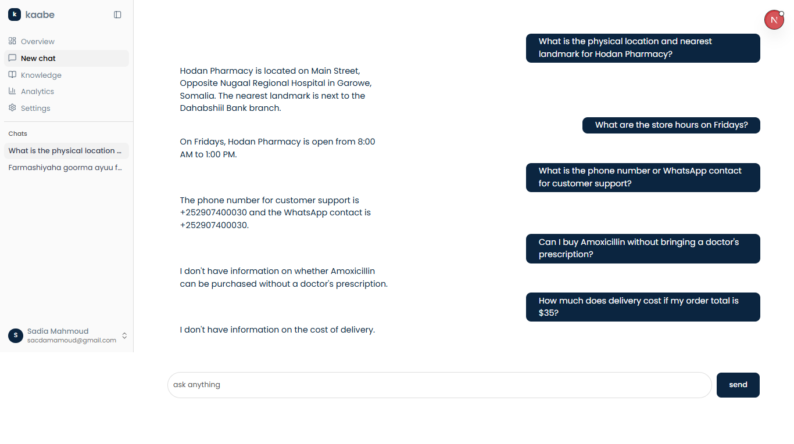

# 🤖 Kaabe — AI Assistant for Somali Businesses

Kaabe is a SaaS-style AI assistant designed for Somali businesses.

A business owner can create their business, upload business knowledge, and give customers a public AI assistant that answers questions using the business's own information.

> **Product vision:** An AI employee that knows one business and answers that business's customers.

---

## 🎯 Project Goal

Kaabe is built to help businesses provide an AI-powered customer support experience based on their own knowledge.

The system can:

- Create and manage a business
- Generate a unique public business URL
- Upload business documents
- Extract and chunk document content
- Generate embeddings
- Store vectors in Pinecone
- Retrieve business-specific information using RAG
- Answer customer questions using Gemini
- Support authenticated business-owner chat
- Support anonymous public customer chat
- Persist conversations and messages
- Keep businesses isolated from one another
- Provide business analytics through the dashboard

The current MVP focuses on building a secure, multi-tenant RAG system that connects a business's knowledge base directly to its customers.

---


## 🎥 Demo

Kaabe provides a complete AI customer-support workflow for businesses — from business onboarding and knowledge management to customer conversations.

### 🏠 Landing Page

The Kaabe landing page introduces the platform and allows businesses to get started or try a public assistant.



### 📊 Business Dashboard

Business owners can manage their AI assistant, monitor conversations, view knowledge documents, and track activity.



### 📚 Knowledge Base

Businesses can upload their own knowledge and use it as the foundation for their AI assistant.



### 💬 Public AI Assistant

Every business receives a unique public assistant URL. Customers can ask questions without creating an account.



### 🔗 Example Public Assistants


The assistant retrieves information specifically from the selected business's knowledge base, keeping each business's data isolated.


## 🏗️ Architecture

```text
                         ┌─────────────────────┐
                         │   Business Owner    │
                         └──────────┬──────────┘
                                    │
                                    ▼
                         ┌─────────────────────┐
                         │   Authentication    │
                         │     Better Auth     │
                         └──────────┬──────────┘
                                    │
                                    ▼
                         ┌─────────────────────┐
                         │      Dashboard      │
                         └──────────┬──────────┘
                                    │
                    ┌───────────────┼───────────────┐
                    │               │               │
                    ▼               ▼               ▼
             ┌────────────┐ ┌────────────┐ ┌────────────┐
             │  Knowledge │ │    Chat    │ │ Analytics  │
             │    Base    │ │            │ │            │
             └─────┬──────┘ └─────┬──────┘ └────────────┘
                   │               │
                   ▼               │
             ┌────────────┐        │
             │ PDF Loader │        │
             └─────┬──────┘        │
                   │               │
                   ▼               ▼
             ┌────────────┐ ┌──────────────┐
             │  Chunking  │ │ Embed Query  │
             │ LangChain  │ └──────┬───────┘
             └─────┬──────┘        │
                   │               ▼
                   ▼        ┌──────────────┐
             ┌────────────┐ │   Pinecone   │
             │  Gemini    │ │  Similarity  │
             │ Embeddings │ │    Search    │
             └─────┬──────┘ └──────┬───────┘
                   │               │
                   ▼               ▼
             ┌─────────────────────────────┐
             │          Pinecone            │
             │       Vector Database        │
             └──────────────┬──────────────┘
                            │
                            ▼
                   ┌──────────────────┐
                   │  Gemini 2.5 Flash│
                   │ + Retrieved      │
                   │    Context       │
                   └────────┬─────────┘
                            │
                            ▼
                   ┌──────────────────┐
                   │  Customer Answer │
                   └──────────────────┘

```

---


## 🔄 RAG Pipeline

Kaabe uses **Retrieval-Augmented Generation (RAG)** to answer questions using business-specific knowledge.

### 1. Upload

A business owner uploads a document containing information about their business.

Currently supported:

- PDF
- TXT
- Markdown
- DOCX


### 2. Extract

PDF documents are processed using LangChain's `PDFLoader`.

### 3. Chunk

The extracted content is split into smaller pieces using:

```text
RecursiveCharacterTextSplitter

```

Current configuration:

```text
chunkSize: 1000
chunkOverlap: 200

```


### 4. Embed

Each chunk is converted into a vector using:

```text
gemini-embedding-001

```

The embeddings use a:

```text
3072-dimensional vector space

```


### 5. Store

The vectors are stored in Pinecone together with metadata:

```text
businessId
documentId
text

```

The `businessId` is critical for multi-business data isolation.

### 6. Retrieve

When a customer asks a question:

1. The question is embedded.
2. Pinecone performs a similarity search.
3. The search is filtered by `businessId`.
4. The most relevant chunks are returned.
5. Results below the relevance threshold are discarded.

Current similarity threshold:

```text
0.70

```


### 7. Generate

The retrieved context is provided to Gemini 2.5 Flash.

The model is instructed to answer using the retrieved business information and avoid inventing information that is not present in the knowledge base.

---


## 🏢 Multi-Business Architecture

Kaabe is designed as a multi-tenant application.

Each business has its own:

```text
Business
   │
   ├── slug
   ├── documents
   ├── conversations
   └── knowledge vectors

```

Every vector stored in Pinecone contains the business identifier.

For example:

```text
Sahal Restaurant
businessId = business_123

Hodan Pharmacy
businessId = business_456

```

A search for Sahal Restaurant can therefore only retrieve:

```text
businessId = business_123

```

and cannot retrieve Hodan Pharmacy's knowledge.

### Business URLs

Each business receives a unique slug.

Examples:

```text
/chat/sahal-restaurant
/chat/hodan-pharmacy

```

The slug is generated automatically from the business name.

---


## 🔐 Security & Data Isolation

Security is an important part of Kaabe's architecture.

### Authentication

Better Auth protects business-owner functionality and dashboard access.

### Business Ownership

Authenticated business operations use the user's session rather than trusting a user ID supplied by the client.

### Vector Isolation

Pinecone queries are scoped using:

```text
businessId = currentBusiness.id

```

This prevents one business from retrieving another business's knowledge.

### Conversation Isolation

Owner conversations are verified against the authenticated user and their business.

Public conversations are verified against the business associated with the requested slug.

### Anonymous Customer Conversations

Customers do not need an account to use a business assistant.

Public conversations use:

```text
userId = null
businessId = currentBusiness.id

```

This allows customer conversations to be stored while keeping the customer anonymous.

---


## 💬 Example Businesses

Kaabe currently uses fictional businesses for testing.

### Sahal Restaurant

```text
/chat/sahal-restaurant

```

Example knowledge:

- Menu
- Prices
- Opening hours
- Location
- Restaurant services
- Policies
- FAQs

Example question:

```text
What time does Sahal Restaurant close?

```


### Hodan Pharmacy

```text
/chat/hodan-pharmacy

```

Example knowledge:

- Pharmacy information
- Opening hours
- Location
- Product categories
- Delivery
- Payment methods
- FAQs

Example question:

```text
Farmashiyaha goorma ayuu furmaa?

```

The two businesses also provide a useful way to test **multi-tenant RAG isolation**.

---


## 💾 Data Storage

Kaabe uses two primary data stores.

### PostgreSQL — Neon

PostgreSQL stores application data such as:

- Users
- Sessions
- Businesses
- Documents
- Conversations
- Messages

Database access is handled through **Drizzle ORM**.

### Pinecone

Pinecone stores vector data:

- Document embeddings
- Chunk text
- Business metadata
- Document metadata

PostgreSQL manages application state while Pinecone handles semantic retrieval.

---


## 🧰 Tech Stack


| Technology        | Purpose                          |
| ----------------- | -------------------------------- |
| Next.js           | Full-stack web application       |
| React             | User interface                   |
| TypeScript        | Type safety                      |
| Tailwind CSS      | Styling                          |
| shadcn/ui         | UI components                    |
| Better Auth       | Authentication                   |
| PostgreSQL / Neon | Application database             |
| Drizzle ORM       | Database queries and schema      |
| Pinecone          | Vector database                  |
| LangChain         | Document processing and chunking |
| Gemini Embeddings | Text embeddings                  |
| Gemini 2.5 Flash  | AI response generation           |
| AI SDK            | AI/chat streaming                |


---


## 📁 Project Structure

```text
.
├── app/
│   ├── api/
│   │   ├── chat/
│   │   │   └── route.ts
│   │   └── public/
│   │       └── chat/
│   │           └── route.ts
│   │
│   ├── chat/
│   │   └── [slug]/
│   │       └── page.tsx
│   │
│   ├── dashboard/
│   │   ├── chat/
│   │   ├── knowledge/
│   │   ├── analytics/
│   │   ├── settings/
│   │   ├── error.tsx
│   │   └── page.tsx
│   │
│   └── ...
│
├── components/
│   ├── chat.tsx
│   ├── app-sidebar.tsx
│   └── message-trend-chart.tsx
│
├── db/
│   ├── drizzle.ts
│   └── schema.ts
│
├── lib/
│   ├── auth.ts
│   ├── embeddings.ts
│   ├── pinecone.ts
│   └── search.ts
│
├── drizzle/
│
├── public/
│
├── .env.local
├── drizzle.config.ts
├── package.json
└── README.md

```

---


## ⚙️ Getting Started


### Prerequisites

Make sure you have:

- Node.js
- npm or pnpm
- PostgreSQL / Neon account
- Pinecone account
- Google AI / Gemini API key
- Google OAuth credentials if using Google sign-in


### 1. Clone the repository

```bash
git clone <your-repository-url>
cd <project-directory>

```


### 2. Install dependencies

```bash
npm install

```

Or:

```bash
pnpm install

```


### 3. Configure environment variables

Create a `.env.local` file:

```env
DATABASE_URL=your_neon_database_url

BETTER_AUTH_SECRET=your_better_auth_secret
BETTER_AUTH_URL=http://localhost:3000

GOOGLE_CLIENT_ID=your_google_client_id
GOOGLE_CLIENT_SECRET=your_google_client_secret

GOOGLE_GENERATIVE_AI_API_KEY=your_google_ai_api_key

PINECONE_API_KEY=your_pinecone_api_key
PINECONE_INDEX=rag-documents

```

> Never commit `.env.local` or expose API keys in client-side code.


### 4. Set up the database

Run the project's Drizzle commands:

```bash
npm run db:generate
npm run db:migrate

```

Use the scripts defined in `package.json` if your local project uses different command names.

### 5. Start the development server

```bash
npm run dev

```

Open:

```text
http://localhost:3000

```

---


## 🧪 Testing Kaabe

A basic end-to-end test looks like this:

### Business owner

1. Create an account.
2. Create a business.
3. Verify that a business slug is generated.
4. Open the Knowledge Base.
5. Upload business documents.
6. Wait for processing.
7. Open the dashboard chat.
8. Ask questions about the uploaded knowledge.
9. Verify that conversations persist.


### Customer

1. Open the business's public URL:

```text
/chat/sahal-restaurant

```

1. Ask a business-related question.
2. Ask multiple questions in the same conversation.
3. Refresh the page and verify conversation behavior.


### Multi-business isolation

1. Create or use a second business:

```text
/chat/hodan-pharmacy

```

1. Ask questions about Hodan Pharmacy.
2. Verify that Hodan Pharmacy does not retrieve Sahal Restaurant information.
3. Verify that Sahal Restaurant does not retrieve Hodan Pharmacy information.


### Grounding test

Ask something that does not exist in the knowledge base:

```text
Does this business have a swimming pool?

```

The assistant should indicate that it does not have enough information instead of inventing an answer.

---

## 🚧 Roadmap


### Next

- Improve document processing status and error handling
- Better analytics
- Frequently asked questions
- Unanswered question detection
- Knowledge gaps
- Somali + English response improvements


### Future

- WhatsApp integration
- Source citations in responses
- Improved retrieval and reranking
- Business-specific AI configuration
- Automated knowledge updates
- Customer satisfaction tracking
- Multiple business/team members
- Subscription and SaaS billing
- Production monitoring
- Usage limits and billing

---


## 🎯 Product Vision

Kaabe is built around one simple idea:

> **Give every Somali business an AI employee that knows their business.**

Instead of giving customers generic AI answers, Kaabe retrieves information from the business's own knowledge and uses it to provide relevant, grounded answers.

The long-term goal is to make practical AI customer support accessible to businesses in Somalia and beyond.

---


## 👩🏽‍💻 Built By

**Sadia Mahmoud**

Computer Science Student & Full-Stack / AI Developer

Building practical AI products for Somali businesses.